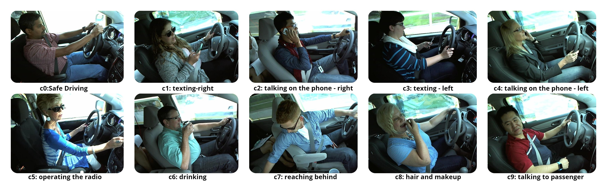
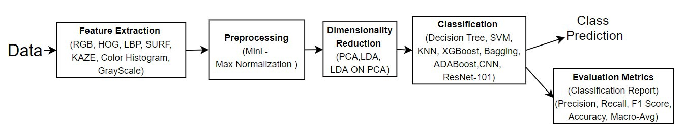
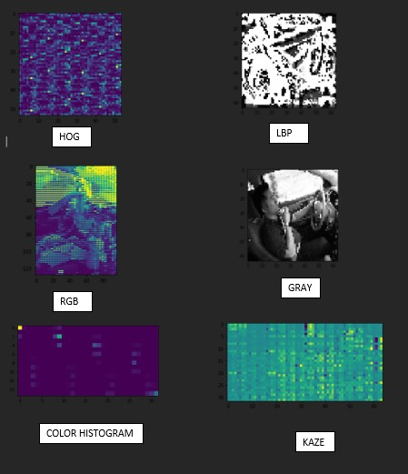

# Machine Learning Techniques for Distracted Driver Detection
Driving a car is a complex task, and it requires complete attention. Distracted driving is any activity that takes away the driver’s attention from the road. Approximately 1.35 million people die each year as a result of road traffic crashes.
Road traffic crashes cost most countries 3% of their gross domestic product So, our aim/goal in this project is to detect if the car driver is driving safe or performing any activity that might result in an accident or any harm to others, by using various Machine Learning Models to classify the provided images into different categories of Distraction.
# Dataset:
The dataset used is State Farm Distracted Driver Detection taken from https://drive.google.com/file/d/1qWNtMRN8m_0Ipm_rA6g0KrucbV5zyWKA/view
The dataset has 22424 training images, 79727 testing images and has 10 classes. The images are coloured and are of size 640×480 pixels. The classes are labelled as follows:
c0: safe driving
c1: texting — right
c2: talking on the phone — right
c3: texting — left
c4: talking on the phone — left
c5: operating the radio
c6: drinking
c7: reaching behind
c8: hair and makeup
c9: talking to a passenger
Dataset Visualization

# Data Pre-processing
Images are resized to 64 × 64 × 3 using CV2 in order to improve the computing efficiency of the classifier.
Stratified splitting is used to split the dataset into 80:20 Training-Testing ratio. The training dataset is further split into 90:10 Training-Validation set.
Thus, the final training set has 16145 images; the final validation set has 1794 images and the final testing set has 4485 images.
# Workflow

# Feature Extraction Techniques:

Following feature extraction techniques were used for extracting features from the images:
* HOG — The histogram of oriented gradients
(HOG) is a feature descriptor used in computer vision and image processing for the purpose of object detection. The technique counts occurrences of gradient orientation in localized portions of an image.
* LBP — Local Binary Pattern (LBP)
LBP is a simple yet very efficient texture operator which labels the pixels of an image by thresholding the neighbourhood of each pixel and considers the result as a binary number.
* Color Histogram — 
A color histogram is a representation of the distribution of colors in an image. For digital images, a color histogram represents the number of pixels that have colors in each of a fixed list of color ranges, that span the image’s color space.
* KAZE— 
KAZE is a 2D feature detection and description method that operates completely in nonlinear scale space.Features extracted using Feature Extraction Techniques

# Normalization: 
* Min-Max Normalization
In this technique of data normalization, a linear transformation is performed on the original data. Minimum and maximum value from data is fetched and each value is replaced according to the following formula:
where x is the original value and x’ is the normalized value.

# Dimensionality Reduction:

We have used three dimensionality reduction techniques which are stated below:
* PCA -
Principal component analysis (PCA) is a technique for reducing the dimensionality of datasets, increasing interpretability but at the same time minimizing information loss.
After applying feature extraction techniques, PCA with n_components = 100 components is applied to features extracted from each extraction technique individually and then later combined together to form a combined feature set of 700 features.
* LDA -
Linear discriminant analysis (LDA) is a generalization of Fisher’s linear discriminant, a method used in statistics and other fields, to find a linear combination of features that characterizes or separates two or more classes of objects or events.
* LDA over PCA -
LDA is applied on combined features which are obtained after applying PCA to further reduce the features, get a better class separation and to increase computational efficiency.
 # Models
 * KNN -
 The KNN algorithm assumes that similar things exist in close proximity. In other words, similar things are near to each other KNN captures the idea of similarity (sometimes     called distance, proximity, or closeness).
 
# Ensembling Methods:
* XGBoost -
XGBoost is a decision-tree-based ensemble Machine Learning algorithm that uses a gradient boosting framework. In prediction problems involving unstructured data (images, text, etc.) artificial neural networks tend to outperform all other algorithms or frameworks.
* Bagging -
Bootstrap aggregating also called bagging (from bootstrap aggregating), is a machine learning ensemble meta-algorithm designed to improve the stability and accuracy of machine learning algorithms used in statistical classification and regression. It also reduces variance and helps to avoid overfitting.
* ADABoost -
AdaBoost algorithm, short for Adaptive Boosting, is a Boosting technique that is used as an Ensemble Method in Machine Learning. It is called Adaptive Boosting as the weights are re-assigned to each instance, with higher weights to incorrectly classified instances.
